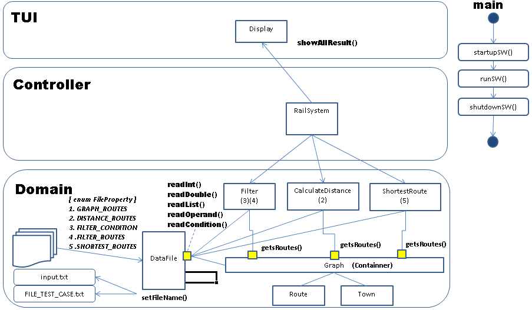
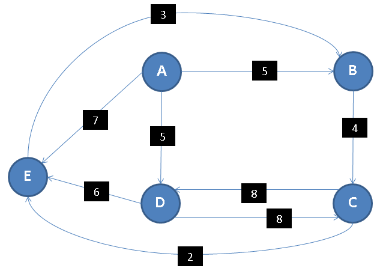
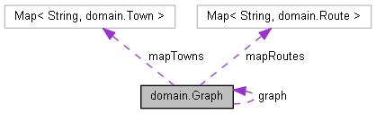
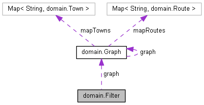
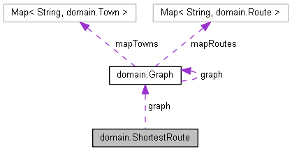
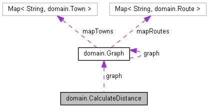
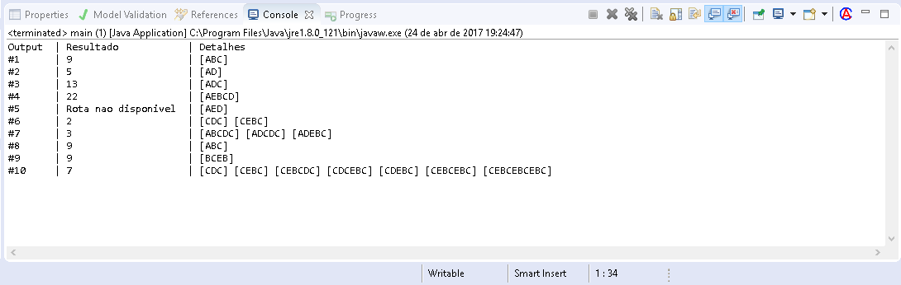

# Sistema gestão de rotas para mobilidade sobre trilhos

## Descrição da arquitetura (3 camadas)
A implementação do software está baseada na arquitetura MVC.

*Model*: Toda a lógica de negócio se encontra na camada domínio 

*controller:* Intermedia as requisições dos usuarios e retorna co o resultado 

*View*: Front End - Interface com o usuario

+ O View recebe uma solicitação do usuário, neste caso nenhuma entrada e feita pelo o usuário. 
+ A camada controller recebe as solicitações do View e as delega para o domain. 
+ Após o domain processar e concluir as requisições, os resultados são devolvidos ao controller.
+ O controller disponibiliza o resultado para o View.
+ View mostra o resultado.  


### Diagrama

Esse diagrama representa uma abstração high level da implementação, não faz parte do portfólio de diagramas do padrão UML.



---

## Arquivo de entrada (input.txt)

As informações no arquivo de entrada estão estruturadas na forma de propriedades

**1. Mapeamentos das estações/rotas**

	graph.routes = AB5, BC4, CD8, DC8, DE6, AD5, CE2, EB3, AE7
	


**Características:**
* Números decimais usar '.'
* Separador por virgula
* Hífen de separação e opcional
* O SW está trabalhando dinamicamente, podendo ser adicionadas novas rotas

>Diagrama está baseado na descrição do teste. 

----

**2. Mapeamento das rotas para cálculo da distância**

	distance.routes	= A-B-C , A-D , A-D-C , A-E-B-C-D , A-E-D

**Características:**
* Hífen de separação e opcional
* Separador virgula
* Possibilidade de adicionar novas rotas.
* Rotas não existentes serão avisadas
	
>Questões abordadas
>* 1-The distance of the route A-B-C
>* 2-The distance of the route A-D.
>* 3-The distance of the route A-D-C.
>* 4-The distance of the route A-E-B-C-D.
>* 5-The distance of the route A-E-D.

----

**3. Condição de STOPS**
	
	filtertrips[1].condition = STOPS <= 3
	filtertrips[1].routes	= C-D-C , C-E-B-C

**Características:**

* Verifica se as rotas indicadas na propriedade filtertrips[X].routes satisfazem a condição indicada em filtertrips[X].condition.
* Condições permitidas: <,>,<=,>=,==,!=
* Operandos permitidos STOPS,DISTANCE
* O hífen e opcional
* Rotas invalidas serão desconsideradas
* Separador por virgula
* Possibilidade de adicionar novos filtros, diferenciar através do index [X]
 
>Questões abordadas
>* 6) The number of trips starting at C and ending at C with a maximum of 3 stops. In the sample data below, there are two such trips: 
C-D-C (2 stops). and C-E-B-C (3 stops).

---

**4. Condição de STOPS**
	
	filtertrips[2].condition = STOPS==4
	filtertrips[2].routes	= A-B-C-D-C , A-D-C-D-C, A-D-E-B-C, AB

**Características:**
* Verifica se as rotas indicadas na propriedade filtertrips[X].routes satisfazem a condição
* indicada em filtertrips[X].condition.
* Condições permitidas: <,>,<=,>=,==,!=
* Operandos permitidos STOPS,DISTANCE
* O hífen e opcional
* Rotas invalidas serão desconsideradas sem nenhuma notificação ao usuário
* Separador por virgula
* Possibilidade de adicionar novos filtros, diferenciar através do index [X]

>Questões abordadas

>* 7-The number of trips starting at A and ending at C with exactly 4 stops. In the sample data below, there are three such trips: A to C (via B,C,D); A to C (via D,C,D); and A to C (via D,E,B). 

---

**5. Procurar menor rota possível**

	shortestRouter.trip	= A-C , B-B

**Características:**
* Encontra as opções de rotas menores(distancia) entre o ponto de partida A e o de chegada B
* Possibilidade de adicionar quantas viagens(rotas) necessárias.
* Rotas invalidas serão desconsideradas sem nenhuma notificação ao usuário  
* O hífen e opcional
* Separador por virgula

>Questões abordadas
>* 8-The length of the shortest route (in terms of distance to travel) from A to C.
>* 9-The length of the shortest route (in terms of distance to travel) from B to B.

----
 
**6. Condição de distância**

	filtertrips[3].condition	= DISTANCE < 30
	filtertrips[3].routes		= CDC , CEBC , CEBCDC , CDCEBC , CDEBC , CEBCEBC , CEBCEBCEBC

**Características:**
* Verifica se as rotas indicadas na propriedade filtertrips[X].routes satisfazem a condição indicada em filtertrips[X].condition.
* Condições permitidas: <,>,<=,>=,==,!=
* Operandos permitidos STOPS,DISTANCE
* O hífen e opcional
* Rotas invalidas serão desconsideradas sem nenhuma notificação ao usuário
* Separador por virgula
* Possibilidade de adicionar novos filtros, diferenciar através do index [X]

>Questões abordadas
>* 10-The number of different routes from C to C with a distance of less than 30. In the sample data, the trips are: CDC, CEBC, 
CEBCDC, CDCEBC, CDEBC, CEBCEBC, CEBCEBCEBC.

[Veja o arquivo de entrada](../input.txt)

---

## Leitura do arquivo de entrada

A classe responsável pela leitura do arquivo de entrada e a DataFile

Todas as entradas(propriedades) do arquivo estão mapeadas no **enun** chamado FileProperty

```java
public enum FileProperty {

	/*Nome da proriedade onde estara mapeados as rotas disponiveis*/
	GRAPH_ROUTES("graph.routes"),
	/*Nome da proriedade onde estara mapeados as rotas para cálculo da distância */
	DISTANCE_ROUTES("distance.routes"),
	/*Nome da proriedade onde estara a condicao para filtro de rotas*/
	FILTER_CONDITION("filtertrips[%d].condition"),
	/*Nome da proriedade onde estara mapeados as rotas para aplicacao do filtro*/
	FILTER_ROUTES("filtertrips[%d].routes"),
	/*Nome da proriedade onde estara mapeados as rotas para calculo da memor distancia*/
	SHORTEST_ROUTES("shortestRouter.trip");

	private String name;

	FileProperty(String name){this.name = name;	}
	public String getName(){	return name;	}
}
```
Para leitura e filtro das informações foram utilizadas expressões regulares (regex)

```java
if(open() && property!=null){
	name_property = index>=0? String.format(property.getName(), index) : property.getName();
	String s = prop.getProperty(name_property);
	if(s!=null){
		values = s.trim().toUpperCa.replaceAll("[^a-zA-Z0-9.,]", "").split(SEPARATOR);
	}
}

```

Mais detalhes click [aqui](html/classutilities_1_1_data_file.html)

---

## Gerenciamento das rotas

As informações, sobre as rotas disponíveis, lidas do arquivo de entrada ficam na entidade **graph**
Essas mesmas informações deverão ser compartilhadas com todas as outras entidades e para que não tenhamos diversas instancias de fontes de informações com o mesmo conteúdo adotamos um padrão Singleton. A criação do objeto do tipo Graph e feita pela chamada do método **Graph.create()** e o construtor está com sua visibilidade como private.

As rotas são armazenadas em maps e utiliza como chave o formato "AB"
As cidades são armazenadas em maps e utiliza como chave o formato "A"

 


Mais detalhes click [aqui](html/classdomain_1_1_graph.html)


---

##Execução das consultas

Enquanto a Graph disponibiliza de forma genérica meios e mecanismos para execução de consultas, existem as classes especialistas 
são elas:  

**Filter:** Utilizara a propriedades *filtertrips[X].routes* e *filtertrips[X].condition* do arquivo de entrada. Como existe a possibilidade dessa tag ser utilizada n vezes no arquivo de entrada se faz necessário informar também o índice [X].



Mais detalhes click [aqui](html/classdomain_1_1_filter.html)


**ShortestRoute:** Utilizara a propriedade *shortestRouter.trip* do arquivo de entrada.



Mais detalhes click [aqui](html/classdomain_1_1_shortest_route.html)

**CalculateDistance** Utilizara a propriedade *distance.routes* do arquivo de entrada.



Mais detalhes click [aqui](html/classdomain_1_1_calculate_distance.html)
---

## Controle

Realizada pela classe RailSystem, onde sua implementação e bem slim devido não ter nenhuma lógica de negócio. 
Delegando todo o trabalho as classes especialistas.

**Static Public Member Functions**


```java
static Route[] filterByStops1();
static Route[] filterByStops2();
static Route[] filterByDistance();
static Route[] calculateDistance();
static Map< String,Route[]> shortestRoute ();
static boolean init();
static void deInit();
```
Mais detalhes click [aqui](html/classcontroller_1_1_rail_system.html)

----

## Packages

**software:** Main

**controller:**	Intermedia a interação entre o Front End(TUI) e o domínio

**frontend:** Cuida da apresentação dos resultados ao usuário

**domain:**	Cuida de todo o negócio (gerenciamento das rotas).

**utilities:** Classes de uso gerais

**translate:** Tradução

**test:** Tests cases para JUnit

Mais detalhes click [aqui](html/namespaces.html)

---

## Testes

Tests cases para serem utilizado com o framework JUnit. Para cada classe da aplicacao existe uma classecom o mesmo none e um sufixo 'Test'


----

## Text User interface
Abaixo podemos visualizar a saída no console.



---

## Boas práticas

**1. Coesão:** Métodos e classes com o objetivo claro, preciso e tamanho reduzido

**2. Encapsulamento:** Todos os atributos foram encapsulado e mantidos como private única forma de acesso e através de métodos

**3. Visibilidade:** Mantido somente os métodos necessários como public
 
**4. Designer Patterns**
* Interface
* Containner
* Singleton
* Factory Method

**5. Baixo Acoplamento:** Com as 3  camadas o acoplamento entre o business layer e o front end e bem baixo. Como melhoria poderá ser definido uma interface de entrega dos resultados entre o controler e o domain. 

**6. Redução de fluxos alternativos (ifs):** Facilita a implementação de testes unitários.

**7. Escalabilidade (Alocação dinâmica):** Recurso alocados conforme a demanda. Podemos dizer que se necessário novas rotas podem ser adicionadas. 

**8. Constantes (números mágicos):** Foram declaradas constantes (static final) ou enumeradores para valores com uma tratativa especial.

**9. Reutilização:** Com a implementação de uma única forma de coleta de informações do arquivo praticamente todos os resultados são obtidos da mesma forma.

**10. Único ponto de retorno dentro dos métodos:** Um único ponto de retorno dentro do método facilita durante o debug

**11. Modularização:** Os pacotes foram criados para modularizar a solução. 

**12. Code Style:**

* Métodos inicia com verbo e caixa baixa

* atributos (substantivos) - camelCasee

* Constantes caixa alta

* Indentação

* Padronização do idioma para definição de nomes de métodos /classes/ atributos

**13. Refatoração:** Durante o processo de implementação alguns códigos foram melhorados para melhorar a testabilidade, manutenibilidade, flexibilidade (escalabilidade)

**14. Modelagem e documentação:** As ferramentas de modelagem e documentação estão sincronizadas com a solução

---

## Engenharia de requisitos

Para prospecção dos requisitos foi utilizado algumas regras para prospecção do requisitos e modelagem do sistema

**Atributos/entidades (substantivos do texto)**

towns, route, graph, starting and ending town,railroad services,stops

**Métodos (verbos do texto)**

compute the distance, shortest route

----

## Ambiente de desenvolvimento

| Tipo         | Tool         |
|--------------| -------------|
| IDE          | Eclipse      |
| Linguagem    | JAVA         |
| Tests        | JUnit        |
| Doxygen      | Documentacao |
| WikiText     |              |

---

## Links
Segue o link dos repositórios e da documentação completa gerada pela ferramenta Doxygen.

Foram disponibilizados 2 links. A versão local pode apresentar problemas devido a exclusão dos arquivos .js necessária antes do envio. 
 
[Doxygen](html/index.html)

[Versão (pdf)](latex/refman.pdf)

---

